# Cluster Analytics Service - Intel® SceneScape

The Cluster Analytics service provides advanced object clustering and movement analysis capabilities for Intel® SceneScape using DBSCAN (Density-Based Spatial Clustering of Applications with Noise) algorithm combined with geometric shape detection and velocity pattern classification.

This service processes real-time object detection data from Intel® SceneScape scenes, applies machine learning-based clustering algorithms, and provides comprehensive analytics including:

- **Spatial Clustering**: Groups objects by proximity using DBSCAN algorithm with user-configurable parameters
- **Cluster Tracking**: Tracks clusters across frames with state-based lifecycle management (NEW → ACTIVE → STABLE → FADING → LOST)
- **Shape Analysis**: Detects geometric patterns (circle, rectangle, line, irregular) with size measurements
- **Velocity Analysis**: Classifies movement patterns and tracks cluster dynamics

## Deployment

### Docker Deployment

#### Using Docker Compose (Recommended)

The cluster analytics service is included in the extended Intel® SceneScape demo docker-compose stack:

```bash
SUPASS=admin123 make
SUPASS=admin123 make demo-all
```

## Architecture

### Data Flow Diagram


### 🔍 **DBSCAN Clustering Configuration**

#### User-Configurable Parameters

The `config.json` file allows customization of DBSCAN clustering parameters:

- **`eps`** - Maximum distance (in meters) between objects to be considered in the same cluster
- **`min_samples`** - Minimum number of objects required to form a cluster

These parameters can be configured globally (default) or per object category.

#### Configuration File Structure

The service uses a `config.json` file located in the `config/` directory:

```json
{
  "dbscan": {
    "default": {
      "eps": 1,
      "min_samples": 3
    },
    "category_specific": {
      "person": {
        "eps": 2,
        "min_samples": 2
      },
      "vehicle": {
        "eps": 4.0,
        "min_samples": 2
      },
      "bicycle": {
        "eps": 1.5,
        "min_samples": 2
      },
      "motorcycle": {
        "eps": 2.5,
        "min_samples": 2
      },
      "truck": {
        "eps": 5.0,
        "min_samples": 2
      },
      "bus": {
        "eps": 6.0,
        "min_samples": 2
      }
    }
  }
}
```

#### Parameter Descriptions

- **`default`**: Fallback parameters for object categories not explicitly configured
- **`category_specific`**: Per-category parameters optimized for different object types:
  - `person` - Optimized for people clustering (social distancing, queues)
  - `vehicle` - Optimized for vehicle parking, traffic clusters
  - `bicycle` - Optimized for bike racks, group riding
  - `motorcycle` - Moderate spacing for motorcycle clusters
  - `truck` - Large vehicle spacing requirements
  - `bus` - Bus stops, depot formations

### 📐 Shape Detection & Analysis

- **ML-based Shape Classification**: Detects geometric patterns using feature extraction
- **Size Calculations**: Provides precise measurements for each detected shape type
- **Supported Shapes**:
  - **Circle**: radius, diameter, area, circumference
  - **Rectangle**: width, height, area, perimeter, corner points
  - **Line**: length, endpoints, width spread
  - **Irregular**: bounding box dimensions, point spread

#### Shape Detection Logic

```mermaid
flowchart TD
    A[Cluster Points Input] --> B{Sufficient Points?}
    B -->|< 3 points| C[Insufficient Points]
    B -->|≥ 3 points| D[Calculate Features]

    D --> E[Extract Distance & Angle Features]
    E --> F[Calculate Centroid]
    F --> G[Measure Distance Variance]

    G --> H{Distance Variance < 0.5?}
    H -->|Yes| I[Circle Formation]
    H -->|No| J{Exactly 4 Points?}

    J -->|Yes| K[Check Quadrant Distribution]
    K --> L{≥ 3 Quadrants?}
    L -->|Yes| M[Rectangle Formation]
    L -->|No| N[Continue Analysis]

    J -->|No| O{≥ 5 Points?}
    O -->|Yes| P[Analyze Angle Distribution]
    P --> Q{Uniform Distribution?}
    Q -->|Yes| R[Large Circle Formation]
    Q -->|No| S[Check Linear Formation]

    S --> T{Low Triangle Areas?}
    T -->|Yes| U[Line Formation]
    T -->|No| V[Irregular Shape]

    O -->|No| N
    N --> S

    %% Shape calculations
    I --> I1[Calculate: radius, diameter, area, circumference]
    M --> M1[Calculate: width, height, area, perimeter, corners]
    R --> R1[Calculate: radius, diameter, area, circumference]
    U --> U1[Calculate: length, endpoints, width spread]
    V --> V1[Calculate: bounding box, point spread]
```



### 🏃 Velocity Analysis & Movement Patterns

- **Movement Classification**: 6 distinct movement patterns
- **Velocity Statistics**: Comprehensive speed and direction analysis
- **Pattern Types**:
  - `stationary` - Objects with minimal movement
  - `coordinated_parallel` - Synchronized movement in same direction
  - `converging` - Objects moving toward cluster center
  - `diverging` - Objects moving away from cluster center
  - `loosely_coordinated` - Some coordination but not highly synchronized
  - `chaotic` - Random or unpredictable movement patterns

#### Velocity Analysis Logic


## 🎯 Category-Specific Clustering

The serviceoptimizes DBSCAN parameters based on object categories, providing more accurate clustering for different object types:

### Benefits

- **Optimized Parameters**: Each object type uses clustering parameters optimized for its spatial characteristics
- **Better Accuracy**: Improved clustering accuracy by considering object-specific grouping behaviors
- **Automatic Selection**: Parameters are selected based on detected object category
- **Fallback Support**: Unknown categories use sensible default parameters

### Category Optimization Examples

| Category     | eps (meters) | min_samples | Rationale                                |
| ------------ | ------------ | ----------- | ---------------------------------------- |
| `person`     | 2.0          | 2           | Social distancing, queue formations      |
| `vehicle`    | 4.0          | 2           | Parking lots, traffic clusters           |
| `bicycle`    | 1.5          | 2           | Bike racks, tight group riding           |
| `motorcycle` | 2.5          | 2           | Moderate spacing for motorcycle clusters |
| `truck`      | 5.0          | 2           | Large vehicle spacing requirements       |
| `bus`        | 6.0          | 2           | Bus stops, depot formations              |
| `default`    | 1.0          | 3           | Fallback for unknown categories          |

### Usage in Analysis

The service automatically applies appropriate parameters when processing each object category, with user customizations taking precedence:

```python
# Dynamic parameter selection with user overrides
for category, objects in objects_by_category.items():
    # Get user-configured parameters for this scene and category
    dbscan_params = self.get_dbscan_params_for_category(category, scene_id)
    clustering = DBSCAN(eps=dbscan_params['eps'],
                       min_samples=dbscan_params['min_samples'])
```

### **Cluster Tracking System**

The service includes advanced temporal tracking with state transitions and confidence scoring. These parameters are currently **hardcoded constants** in the implementation and are not user-configurable through `config.json`.

#### State Transition Parameters (Hardcoded)

| Parameter            | Value | Description                              |
| -------------------- | ----- | ---------------------------------------- |
| `FRAMES_TO_ACTIVATE` | 3     | Frames needed to transition NEW → ACTIVE |
| `FRAMES_TO_STABLE`   | 20    | Frames needed for ACTIVE → STABLE        |
| `FRAMES_TO_FADE`     | 15    | Missed frames before FADING state        |
| `FRAMES_TO_LOST`     | 10    | Missed frames before LOST state          |

#### Confidence Parameters (Hardcoded)

| Parameter                        | Value | Description                          |
| -------------------------------- | ----- | ------------------------------------ |
| `INITIAL_CONFIDENCE`             | 0.5   | Starting confidence for new clusters |
| `ACTIVATION_THRESHOLD`           | 0.6   | Confidence needed for activation     |
| `STABILITY_THRESHOLD`            | 0.7   | Confidence needed for stable state   |
| `CONFIDENCE_MISS_PENALTY`        | 0.1   | Confidence penalty per missed frame  |
| `CONFIDENCE_MAX_MISS_PENALTY`    | 0.5   | Maximum cumulative miss penalty      |
| `CONFIDENCE_LONGEVITY_BONUS_MAX` | 0.2   | Maximum bonus for long-term tracking |
| `CONFIDENCE_LONGEVITY_FRAMES`    | 100   | Frames to reach max longevity bonus  |

#### Archival Parameters (Hardcoded)

| Parameter                | Value | Description                            |
| ------------------------ | ----- | -------------------------------------- |
| `ARCHIVE_TIME_THRESHOLD` | 5.0   | Seconds before archiving lost clusters |
| `MAX_ARCHIVED_CLUSTERS`  | 50    | Maximum number of archived clusters    |

#### Cluster Lifecycle States

| State    | Description                          | Transition Trigger                         |
| -------- | ------------------------------------ | ------------------------------------------ |
| `NEW`    | Just detected, awaiting confirmation | Initial detection                          |
| `ACTIVE` | Confirmed and consistently detected  | 3+ consecutive detections, confidence >0.6 |
| `STABLE` | Long-term stable presence            | 20+ frames detected, stability >0.7        |
| `FADING` | Recently missed detections           | 15+ consecutive missed frames              |
| `LOST`   | Not detected for extended period     | 10+ consecutive missed frames              |

#### Confidence Calculation

Cluster tracking confidence is calculated using:

```python
# Base confidence from detection ratio
base_confidence = frames_detected / total_frames

# Penalty for recent misses
miss_penalty = min(frames_missed * 0.1, 0.5)

# Bonus for long-term tracking
longevity_bonus = min(frames_detected / 100, 0.2)

# Final confidence (clamped 0-1)
confidence = clamp(base_confidence - miss_penalty + longevity_bonus, 0.0, 1.0)
```

## 🖥️ **WebUI Features & Real-time Visualization**

The integrated WebUI provides a comprehensive interface for cluster analysis monitoring and configuration:

### **Interactive Visualization**

- **Real-time Canvas**: Live updating visualization of objects and clusters
- **Pan & Zoom**: Navigate through scene data with mouse controls
- **Object Display**: Individual objects colored by cluster assignment
- **Cluster Shapes**: Visual representation of detected cluster geometries
- **Movement Vectors**: Optional display of cluster movement with adjustable scaling
- **Auto-fit**: Automatic view adjustment to focus on current scene data

### **Dynamic Parameter Configuration**

- **Per-Category Controls**: Independent parameter adjustment for each object category
- **Real-time Updates**: Changes apply immediately with automatic re-clustering
- **Scene-Specific Settings**: Each scene maintains its own parameter configuration
- **Reset to Defaults**: Quick restoration of default parameters per category
- **Visual Feedback**: Immediate visualization of parameter change effects

### **Scene Management**

- **Multi-Scene Support**: Switch between available scenes dynamically
- **Auto-Discovery**: Scenes are automatically discovered from MQTT traffic
- **Current Data Focus**: Always displays current state without historic accumulation
- **Object Count Display**: Real-time object and cluster statistics

### **Advanced Controls**

- **Refresh Rate**: Configurable from real-time to custom intervals
- **Movement Vector Scaling**: Adjustable visualization scale for velocity vectors
- **Connection Status**: Live MQTT connection monitoring
- **Parameter Validation**: Intelligent validation based on actual scene data

### **Insufficient Points Handling**

- **Individual Object Coloring**: Objects are colored by category when clusters cannot be formed
- **Clear Messaging**: Visual indication when clustering is not possible
- **Dynamic Thresholds**: Uses user-configured min_samples rather than global defaults

## MQTT Topics & Data Flow

### Input Topics

- **Topic**: `scenescape/regulated/scene/{scene_id}`
- **Purpose**: Receives object detection data from Intel® SceneScape scenes
- **Format**: JSON with objects array and scene metadata
- **Contains**: Scene name, timestamp, object detections with world coordinates

### Output Topics

- **Topic**: `scenescape/analytics/clusters/{scene_id}`
- **Purpose**: Publishes cluster analysis results
- **QoS**: 1 (at least once delivery)
- **Optimized Structure**: Contains only cluster data without redundant scene metadata

### Topic Structure Changes

**Recent Optimization**: Scene identification is now derived from topic structure rather than payload content:

- **Scene ID**: Extracted from topic path (`{scene_id}` component)
- **Scene Name**: Retrieved from DATA_REGULATED topic
- **Cluster Data**: Published to ANALYTICS_CLUSTERS contains only analysis results

## Output Data Structure

The Cluster Analytics service publishes optimized cluster metadata in batch format. **Note**: Scene identification is extracted from topic structure, not payload content.

### Cluster Batch Format

```json
{
  "scene_id": "3bc091c7-e449-46a0-9540-29c499bca18c",
  "scene_name": "Retail",
  "timestamp": "2025-10-21T09:16:41.377Z",
  "total_clusters": 2,
  "clusters": [
    {
      "cluster_id": "a1b2c3d4-e5f6-7890-abcd-ef1234567890",
      "category": "person",
      "objects_in_cluster": 8,
      "cluster_center": {
        "x": 4.291512867202579,
        "y": 4.934464049998539
      },
      "shape_analysis": {
        "shape": "circle",
        "size": {
          "radius": 0.38788961696255303,
          "diameter": 0.7757792339251061,
          "area": 0.4726788625738194,
          "circumference": 2.437182342106631
        }
      },
      "velocity_analysis": {
        "movement_type": "chaotic",
        "average_velocity": [-0.19217192568910546, -0.0763952946379476, 0.0],
        "velocity_magnitude": 0.20680012104899237,
        "movement_direction_degrees": -158.32038869788497,
        "velocity_coherence": 0.0
      },
      "object_ids": [
        "69de7c1c-21da-45bc-ae45-2f1d3d16d5b2",
        "5baec5fa-c961-4dc0-a254-f1f614292619",
        "bf1923d8-ac12-4042-9e76-9b57b351efcb",
        "e6333708-3793-4e44-9b29-e1b7e0e7977c",
        "d9b6d6a9-d390-47a4-a9b8-95af121103ca",
        "9be324af-c0a5-4495-bae6-33d251e88366",
        "166ba387-9b4e-406d-b236-a30bb274a800",
        "71a1b1f6-8e14-4a22-a656-011fa4405c43"
      ],
      "dbscan_params": {
        "eps": 0.5,
        "min_samples": 3,
        "category": "person"
      },
      "tracking": {
        "tracking_id": "a1b2c3d4-e5f6-7890-abcd-ef1234567890",
        "state": "active",
        "confidence": 0.875,
        "stability_score": 0.623,
        "frames_detected": 15,
        "frames_missed": 0,
        "age_seconds": 2.5,
        "time_since_last_seen": 0.03,
        "first_seen": 1729501599.234,
        "last_seen": 1729501601.734,
        "predicted_position": {
          "x": 4.32,
          "y": 4.91
        }
      }
    }
  ],
  "summary": {
    "categories": ["person"],
    "total_objects_in_clusters": 8
  },
  "tracking_statistics": {
    "active_clusters": 2,
    "archived_clusters": 5,
    "clusters_by_state": {
      "new": 0,
      "active": 1,
      "stable": 1,
      "fading": 0,
      "lost": 0
    },
    "tracked_scenes": 2,
    "tracked_categories": 1
  }
}
```

## Field Descriptions

### Batch-Level Fields

| Field                               | Type    | Description                                    |
| ----------------------------------- | ------- | ---------------------------------------------- |
| `scene_id`                          | String  | Unique scene identifier (UUID)                 |
| `scene_name`                        | String  | Human-readable scene name                      |
| `timestamp`                         | String  | ISO 8601 timestamp when clusters were detected |
| `total_clusters`                    | Integer | Total number of clusters in this batch         |
| `clusters`                          | Array   | Array of individual cluster objects            |
| `summary.categories`                | Array   | List of object categories that formed clusters |
| `summary.total_objects_in_clusters` | Integer | Total objects across all clusters              |
| `tracking_statistics`               | Object  | Global tracking system statistics              |

### Individual Cluster Fields

| Field                | Type    | Description                                       |
| -------------------- | ------- | ------------------------------------------------- |
| `cluster_id`         | String  | Unique persistent cluster UUID                    |
| `category`           | String  | Object detection category (person, vehicle, etc.) |
| `objects_in_cluster` | Integer | Number of objects forming the cluster             |
| `object_ids`         | Array   | List of object UUIDs that form this cluster       |
| `dbscan_params`      | Object  | User-configured DBSCAN parameters used            |
| `tracking`           | Object  | Temporal tracking metadata (see below)            |

### Spatial Information

| Field              | Type  | Description                                          |
| ------------------ | ----- | ---------------------------------------------------- |
| `cluster_center.x` | Float | X coordinate of cluster centroid (world coordinates) |
| `cluster_center.y` | Float | Y coordinate of cluster centroid (world coordinates) |

### Shape Analysis

| Field                  | Type   | Description                                                     |
| ---------------------- | ------ | --------------------------------------------------------------- |
| `shape_analysis.shape` | String | Detected shape type: `circle`, `rectangle`, `line`, `irregular` |
| `shape_analysis.size`  | Object | Shape-specific measurements (varies by shape type)              |

#### Shape-Specific Size Fields

**Circle:**

- `radius` - Circle radius in meters
- `diameter` - Circle diameter in meters
- `area` - Circle area in square meters
- `circumference` - Circle circumference in meters

**Rectangle:**

- `width` - Rectangle width in meters
- `height` - Rectangle height in meters
- `area` - Rectangle area in square meters
- `perimeter` - Rectangle perimeter in meters
- `corner_points` - Array of [x,y] corner coordinates

**Line:**

- `length` - Line length in meters
- `endpoints` - Array of two [x,y] endpoint coordinates
- `width_spread` - Standard deviation of perpendicular distances

**Irregular:**

- `bounding_width` - Bounding box width in meters
- `bounding_height` - Bounding box height in meters
- `bounding_area` - Bounding box area in square meters
- `point_spread` - Standard deviation of distances from centroid

### Velocity Analysis

| Field                        | Type         | Description                                 |
| ---------------------------- | ------------ | ------------------------------------------- |
| `movement_type`              | String       | Classified movement pattern                 |
| `average_velocity`           | Array[Float] | [vx, vy, vz] average velocity vector in m/s |
| `velocity_magnitude`         | Float        | Average speed magnitude in m/s              |
| `movement_direction_degrees` | Float        | Movement direction in degrees (-180 to 180) |
| `velocity_coherence`         | Float        | Movement synchronization measure (0-1)      |

### Tracking Metadata

| Field                           | Type    | Description                                             |
| ------------------------------- | ------- | ------------------------------------------------------- |
| `tracking.tracking_id`          | String  | Persistent cluster UUID (same as cluster_id)            |
| `tracking.state`                | String  | Current lifecycle state (new/active/stable/fading/lost) |
| `tracking.confidence`           | Float   | Tracking confidence score (0-1)                         |
| `tracking.stability_score`      | Float   | Cluster stability metric (0-1)                          |
| `tracking.frames_detected`      | Integer | Total frames where cluster was detected                 |
| `tracking.frames_missed`        | Integer | Consecutive frames where cluster was not detected       |
| `tracking.age_seconds`          | Float   | Time since first detection (seconds)                    |
| `tracking.time_since_last_seen` | Float   | Time since last detection (seconds)                     |
| `tracking.first_seen`           | Float   | Unix timestamp of first detection                       |
| `tracking.last_seen`            | Float   | Unix timestamp of last detection                        |
| `tracking.predicted_position.x` | Float   | Predicted X coordinate for next frame                   |
| `tracking.predicted_position.y` | Float   | Predicted Y coordinate for next frame                   |

### Tracking Statistics

| Field                                    | Type    | Description                               |
| ---------------------------------------- | ------- | ----------------------------------------- |
| `tracking_statistics.active_clusters`    | Integer | Total active clusters across all scenes   |
| `tracking_statistics.archived_clusters`  | Integer | Total archived (lost) clusters            |
| `tracking_statistics.clusters_by_state`  | Object  | Count of clusters in each lifecycle state |
| `tracking_statistics.tracked_scenes`     | Integer | Number of scenes with active clusters     |
| `tracking_statistics.tracked_categories` | Integer | Number of object categories being tracked |

### Movement Pattern Classifications

| Pattern                | Description             | Criteria                                     |
| ---------------------- | ----------------------- | -------------------------------------------- |
| `stationary`           | Minimal movement        | Average speed < 0.1 m/s                      |
| `coordinated_parallel` | Synchronized movement   | Velocity coherence > 0.3                     |
| `converging`           | Moving toward center    | >60% objects moving toward cluster center    |
| `diverging`            | Moving away from center | >60% objects moving away from cluster center |
| `loosely_coordinated`  | Some coordination       | Velocity coherence 0.2-0.3                   |
| `chaotic`              | Random movement         | Low velocity coherence, mixed directions     |

### Administrative Fields

| Field                       | Type          | Description                                             |
| --------------------------- | ------------- | ------------------------------------------------------- |
| `object_ids`                | Array[String] | List of individual object IDs in the cluster            |
| `dbscan_params.eps`         | Float         | DBSCAN epsilon parameter used for this category         |
| `dbscan_params.min_samples` | Integer       | DBSCAN minimum samples parameter used for this category |
| `dbscan_params.category`    | String        | Object category for which parameters were optimized     |

## Production Data Analysis

### Real Deployment Performance

Based on actual production deployment on `broker.scenescape.intel.com`:

- **Active Scenes**: "Queuing" (`302cf49a-97ec-402d-a324-c5077b280b7b`), "Retail" (`3bc091c7-e449-46a0-9540-29c499bca18c`)
- **Object Volume**: 62 person objects per frame in busy queuing scenarios
- **Cluster Formation**: Typically 2 clusters formed (42-43 objects in main cluster, 4 objects in secondary cluster)
- **Noise Points**: 15-17 unclustered objects (24-27% noise ratio)
- **Shape Patterns**: 100% circle formations observed in production
- **Movement Types**: Mix of "chaotic" (main clusters) and "stationary" (small clusters)

### Performance Characteristics

- **Processing Speed**: Real-time analysis of 60+ objects per frame
- **Network Connectivity**: Reliable MQTT connectivity to production broker
- **Shape Detection**: Consistent circle detection with radius measurements 0.16-0.87 meters
- **Velocity Analysis**: Accurate movement classification with coherence measurements

## Usage Examples

### Real-time Monitoring

Subscribe to the ANALYTICS_CLUSTERS topic to receive live cluster updates:

```bash
mosquitto_sub -h broker.scenescape.intel.com -t "scenescape/analytics/clusters/+" -v
```

### Processing Cluster Data

Example Python code to process cluster metadata with tracking information:

```python
import json
import paho.mqtt.client as mqtt

def on_message(client, userdata, message):
    try:
        cluster_batch = json.loads(message.payload.decode())

        scene_name = cluster_batch['scene_name']
        scene_id = cluster_batch['scene_id']
        total_clusters = cluster_batch['total_clusters']

        print(f"\n=== Scene: {scene_name} ({scene_id}) ===")
        print(f"Total Clusters: {total_clusters}")

        # Process tracking statistics
        stats = cluster_batch.get('tracking_statistics', {})
        print(f"\nTracking Statistics:")
        print(f"  Active Clusters: {stats.get('active_clusters', 0)}")
        print(f"  Archived Clusters: {stats.get('archived_clusters', 0)}")

        state_counts = stats.get('clusters_by_state', {})
        print(f"  States: {state_counts}")

        # Process individual clusters
        for cluster in cluster_batch['clusters']:
            cluster_id = cluster['cluster_id']
            category = cluster['category']
            object_count = cluster['objects_in_cluster']

            # Tracking information
            tracking = cluster['tracking']
            state = tracking['state']
            confidence = tracking['confidence']
            stability = tracking['stability_score']
            age_seconds = tracking['age_seconds']

            print(f"\n--- Cluster {cluster_id[:8]}... ---")
            print(f"  Category: {category}")
            print(f"  Objects: {object_count}")
            print(f"  State: {state}")
            print(f"  Confidence: {confidence:.3f}")
            print(f"  Stability: {stability:.3f}")
            print(f"  Age: {age_seconds:.1f}s")
            print(f"  Frames Detected: {tracking['frames_detected']}")
            print(f"  Frames Missed: {tracking['frames_missed']}")

            # Movement and shape analysis
            movement_type = cluster['velocity_analysis']['movement_type']
            shape = cluster['shape_analysis']['shape']

            print(f"  Movement: {movement_type}")
            print(f"  Shape: {shape}")

            # Shape-specific measurements
            if shape == "circle":
                radius = cluster['shape_analysis']['size']['radius']
                print(f"  Circle radius: {radius:.2f}m")
            elif shape == "rectangle":
                width = cluster['shape_analysis']['size']['width']
                height = cluster['shape_analysis']['size']['height']
                print(f"  Rectangle: {width:.2f}m x {height:.2f}m")

            # Predicted position for next frame
            pred_pos = tracking['predicted_position']
            if pred_pos['x'] is not None:
                print(f"  Predicted Position: ({pred_pos['x']:.2f}, {pred_pos['y']:.2f})")

    except Exception as e:
        print(f"Error processing cluster data: {e}")
        import traceback
        traceback.print_exc()

client = mqtt.Client()
client.on_message = on_message
client.connect("broker.scenescape.intel.com", 1883, 60)
client.subscribe("scenescape/analytics/clusters/+")
client.loop_forever()
```

## 🔍 **Cluster Tracking Algorithm**

### Overview

The Cluster Analytics service implements cluster tracking system to maintain cluster identities across video frames. This enables long-term analysis of cluster behavior, movement patterns, and lifecycle dynamics.

### Tracking Pipeline


### Hungarian Matching Algorithm

The system uses the Hungarian algorithm with a multi-feature cost matrix to optimally match new detections to existing tracked clusters:

**Cost Calculation:**

```python
# Hard constraint: must be same category
if tracked.category != detection.category:
    return INFINITE_COST

# Multi-feature cost matrix (weighted)
position_cost = distance(predicted_position, detection_position) * 0.4
velocity_cost = distance(tracked_velocity, detection_velocity) * 0.3
size_cost = abs(tracked_size - detection_size) * 0.2
shape_cost = (1.0 if shapes_match else 2.0) * 0.1

total_cost = position_cost + velocity_cost + size_cost + shape_cost
```

**Matching Process:**

1. Build cost matrix for all (cluster, detection) pairs
2. Apply Hungarian algorithm for optimal assignment
3. Filter matches by maximum distance threshold (default: 5.0 meters)
4. Return valid matches with similarity scores

### State Machine Transitions


### Confidence Metrics

**Detection Consistency:**

- Base confidence = frames_detected / total_frames
- Represents overall detection reliability

**Miss Penalty:**

- Penalty = min(frames_missed \* 0.1, 0.5)
- Reduces confidence for recent detection failures

**Longevity Bonus:**

- Bonus = min(frames_detected / 100, 0.2)
- Rewards long-term stable tracking

**Final Confidence:**

```python
confidence = clamp(base_confidence - miss_penalty + longevity_bonus, 0.0, 1.0)
```

### Stability Score

Measures cluster consistency based on recent history (last 10 observations):

**Position Stability:**

- Low position variance indicates stable location
- `position_stability = 1.0 / (1.0 + position_variance)`

**Size Stability:**

- Consistent cluster size over time
- `size_stability = 1.0 / (1.0 + size_variance)`

**Shape Consistency:**

- Frequency of most common shape
- `shape_consistency = most_common_count / total_observations`

**Combined Score:**

```python
stability_score = (
    0.4 * position_stability +
    0.3 * size_stability +
    0.3 * shape_consistency
)
```

### History Management

Each tracked cluster maintains historical observations:

**Stored Data:**

- Position history: (x, y, timestamp)
- Velocity history: (vx, vy, timestamp)
- Size history: object counts
- Shape history: detected shapes
- Timestamps: frame timestamps

**Limits:**

- Maximum history size: 100 observations
- Automatic truncation when limit exceeded
- Maintains most recent observations

### Prediction System

Clusters use linear extrapolation for position prediction:

```python
# Calculate average velocity from recent history (last 5 observations)
avg_velocity = mean(recent_velocities)

# Predict next position (assuming ~1 frame time delta)
predicted_position = current_position + avg_velocity
```

**Benefits:**

- Improves matching accuracy for moving clusters
- Handles temporary occlusions
- Reduces false negatives in tracking

### Archival System

**Archival Criteria:**

- Cluster state = LOST
- Time since last seen > 5.0 seconds (configurable)

**Archive Management:**

- Maximum 50 archived clusters (global limit)
- Oldest archived clusters removed when limit exceeded
- Preserves full history for analysis

**Statistics Tracking:**

- Active clusters count
- Archived clusters count
- Clusters by state distribution
- Tracked scenes and categories

## DBSCAN Noise Point Explanation

In the DBSCAN clustering algorithm, **noise points** are objects that do not belong to any cluster. Understanding noise points is important for interpreting analytics results in the Cluster Analytics microservice.

### DBSCAN Algorithm Overview

DBSCAN (Density-Based Spatial Clustering of Applications with Noise) classifies each data point as one of:

- **Core points**: Have at least `min_samples` neighbors within `eps` distance.
- **Border points**: Are within `eps` distance of a core point but do not have enough neighbors to be core points themselves.
- **Noise points**: Are neither core nor border points—these are isolated from other points.

### Noise Points in Cluster Analytics

In this service, noise points are objects that:

- Are farther than the configured `eps` distance (e.g., 1.5 meters) from any other object of the same category.
- Do not have enough nearby neighbors to form a cluster (fewer than `min_samples`).

**Example Scenarios:**

- **Queuing Scene**:
  - 5 people detected.
  - 3 people stand close together (within 1.5m): form 1 cluster.
  - 2 people stand alone, each more than 1.5m from others: these are noise points.
- **Retail Scene**:
  - 4 people detected.
  - 2 people are near each other: form 1 cluster.
  - 2 people are isolated: noise points.

### Code Representation

In DBSCAN output, objects labeled with `-1` are noise points. These represent people or objects that are spatially isolated and do not form meaningful groups with others of the same category.

### Why Noise Points Matter

Identifying noise points helps distinguish between:

- **Clustered behavior**: People or objects grouping together.
- **Individual behavior**: People or objects standing alone or isolated.

This distinction is valuable for analytics, enabling insights into both group dynamics and solitary activity within a scene.

### Logging Benefits

- **Reduced Log Volume**: Eliminates verbose JSON serialization in production
- **Performance**: Avoids expensive string formatting when not needed
- **Operational**: Clear cluster summaries for monitoring and alerting
- **Debugging**: Full metadata available when debug logging is enabled

## Contributing

When contributing to the Cluster Analytics service:

1. **Algorithm Improvements**: Enhance clustering accuracy or add new shape detection patterns
2. **Performance Optimization**: Optimize processing speed for high-volume scenarios
3. **New Movement Patterns**: Add additional velocity analysis classifications
4. **Testing**: Include unit tests for clustering and shape detection algorithms

## License

This project is licensed under the Apache 2.0 License. See the LICENSE file for details.
