# ADR 7: Tracker Service

- **Author(s)**: [Józef Daniecki](https://github.com/jdanieck)
- **Date**: 2025-12-08
- **Status**: `Accepted`

## TLDR

Split Controller into two services: **Tracker Service** (pure C++) handles real-time tracking with data-oriented design enabling compiler auto-vectorization (SIMD), while **Analytics Service** (Python) provides spatial analytics and event detection. This eliminates GIL limitation, maximizes CPU cache efficiency, and enables true multiprocessing to meet current scale (300 objects @ 4 cameras @ 15 FPS) and future growth.

## Context

The SceneScape Controller must process multiple scenes with 4 cameras at 15 FPS (67ms frame intervals) with 1000 objects per frame while providing both real-time tracking and rich analytics capabilities. Long-term scale requirements will likely increase across all dimensions: cameras, FPS, scene and object counts.

SceneScape v2025.2 Controller runs as a single Python microservice that calls C++ via pybind11 for performance-critical operations like positioning, tracking and spatial analytics. However, analysis shows the Python orchestration layer and analytics processing stages create overhead that prevents meeting real-time constraints at target scale

The current hybrid implementation (Python + C++ pybind11) cannot utilize modern hardware efficiently due to:

- **GIL prevents true multiprocessing**: Python's Global Interpreter Lock serializes execution, preventing parallel processing across CPU cores
- **Object-oriented design**: Poor CPU cache utilization from scattered memory access patterns
- **Boundary overhead**: Repeated memory allocation/deallocation across Python-C++ boundaries
- **Individual object processing**: Prevents efficient batch operations and compiler auto-vectorization
- **Mixed critical path**: Real-time tracking mixed with non-critical analytics processing

### Data flow overview

The current Controller service processes all camera data through a hybrid Python + C++ (pybind11) pipeline.

```mermaid
flowchart TD
    subgraph "Input Stage"
        C1["📷 Camera 1<br/>MQTT Messages"]
        C2["📷 Camera 2<br/>MQTT Messages"]
        S1["🛰️ Sensor 1<br/>MQTT Messages"]
        S2["🛰️ Sensor 2<br/>MQTT Messages"]
    end

    subgraph "Controller Service"
        P1["🐍 Message Parsing<br/>(Python)<br/>JSON decode"]
        P2["🐍 Data Validation<br/>(Python)<br/>Schema validation"]
        P3["🔧 Coordinate Transform<br/>(C++ via pybind11)"]
        P4["🔧 Object Tracking<br/>(C++ via pybind11)"]
        P5["🐍 Spatial Analytics<br/>(Python)<br/>Region checks"]
        P6["🐍 Event Detection<br/>(Python)<br/>State comparison"]
    end

    subgraph "Output Stage"
        O1["📤 Tracking MQTT<br/>`scenescape/data/scene/{scene_id}/{thing_type}`"]
        O2["📤 Analytics MQTT<br/>`scenescape/regulated/scene/{scene_id}`"]
        O3["📤 Event MQTT<br/>`scenescape/event/...`"]
    end

    C1 --> P1
    C2 --> P1
    S1 --> P1
    S2 --> P1

    P1 --> P2
    P2 --> P3
    P3 --> P4
    P4 --> P5
    P5 --> P6

    P4 --> O1
    P5 --> O2
    P6 --> O3

    style P1 fill:#4a5568,stroke:#cbd5e0,stroke-width:2px,color:#e2e8f0
    style P2 fill:#4a5568,stroke:#cbd5e0,stroke-width:2px,color:#e2e8f0
    style P3 fill:#2d3748,stroke:#90cdf4,stroke-width:3px,color:#bee3f8
    style P4 fill:#2d3748,stroke:#90cdf4,stroke-width:3px,color:#bee3f8
    style P5 fill:#4a5568,stroke:#cbd5e0,stroke-width:2px,color:#e2e8f0
    style P6 fill:#4a5568,stroke:#cbd5e0,stroke-width:2px,color:#e2e8f0
```



**Legend:**

- 🐍 **Python**: Orchestration and analytics logic
- 🔧 **C++ (pybind11)**: Performance-critical operations called from Python

### Python GIL prevents true parallelism

The Global Interpreter Lock (GIL) in CPython allows only one thread to execute Python bytecode at a time, even on multi-core processors. For the current hybrid architecture, this creates critical performance limitations:

1. **Serialization**: When processing 1000 objects per frame, even though C++ tracking code releases the GIL, the Python orchestration layer (message parsing, validation, analytics) still requires the GIL. Multiple camera streams cannot process Python code in parallel, forcing sequential execution despite having multiple CPU cores available.

1. **Context switching overhead**: Each transition between Python and C++ requires acquiring and releasing the GIL. This constant lock contention creates CPU cycles wasted on synchronization rather than useful computation.

1. **Cache invalidation**: Thread switching during GIL acquisition/release invalidates CPU caches, degrading performance of both Python and C++ code paths. Data that was in L1/L2 cache gets evicted, forcing slower memory accesses.

### Memory layout: Object-Oriented vs Data-Oriented Design

The current implementation uses **Object-Oriented Design (OOD)** where each tracked object is represented as a class instance with methods and encapsulated data. While this provides clean abstractions, it creates severe performance penalties for batch processing workloads.

**Object-Oriented Approach** (current):

```python
class TrackedObject:
    def __init__(self, id, position, velocity):
        self.id = id
        self.position = position
        self.velocity = velocity

    def update(self, detection):
        # Process one object at a time
        self.position = transform(detection)
        self.velocity = calculate_velocity(self.position)

# Process 1000 objects individually
for obj in tracked_objects:
    obj.update(detection)  # Scattered memory access, pointer chasing
```

**Problems with OOD for batch processing**:

- **Cache misses**: Each object scattered in memory, accessing `obj.position` causes cache miss
- **Pointer chasing**: Following object pointers prevents CPU prefetching
- **No auto-vectorization**: Compiler cannot vectorize operations across scattered individual objects
- **Memory overhead**: Each object has vtable pointers, padding, heap allocation overhead

**Data-Oriented Design (DOD)** (proposed):

```cpp
struct TrackedObjects {
    std::vector<int> ids;           // All IDs together
    std::vector<vec3> positions;    // All positions together
    std::vector<vec3> velocities;   // All velocities together
};

// Process all 1000 objects in batches
transform_batch(detections, positions);      // Compiler auto-vectorizes
calculate_velocities_batch(positions, velocities);  // Compiler auto-vectorizes
```

**Benefits of DOD** (as per [Mike Acton's CppCon talk](https://www.youtube.com/watch?v=rX0ItVEVjHc)):

- **Cache efficiency**: Contiguous arrays fit in cache lines, CPU prefetcher works optimally
- **Compiler auto-vectorization**: Structure enables compiler to generate SIMD instructions (AVX/AVX2) processing 4-8 objects per CPU cycle
- **No pointer chasing**: Sequential memory access patterns
- **Minimal overhead**: Plain data arrays without object metadata

## Decision

Split the Controller into two specialized services to address the fundamental performance bottlenecks identified above.

**Why separation is necessary:**

1. **Eliminate GIL serialization**: Moving tracking to pure C++ removes Python's GIL entirely from the critical real-time path. This enables true parallel processing across multiple camera streams on multi-core CPUs—impossible with any Python-based architecture.

2. **Enable data-oriented design**: A pure C++ service allows restructuring from object-oriented (scattered memory) to data-oriented (contiguous arrays) design. This transformation:
   - Enables compiler auto-vectorization (SIMD) processing 4-8 objects per CPU cycle
   - Maximizes CPU cache efficiency through contiguous memory access
   - Cannot be achieved in the Python orchestration layer due to language constraints

3. **Remove Python-C++ boundary overhead**: The current architecture incurs repeated memory allocation/deallocation and GIL acquire/release on every pybind11 call. A pure C++ tracking service eliminates these transitions entirely from the hot path.

4. **Decouple critical paths**: Real-time tracking requires different architecture than analytics (no strict timing). Separating them prevents analytics processing from interfering with tracking latency.

**The two services:**

- **Tracker Service** (pure C++) handles the critical real-time tracking path with data-oriented design
- **Analytics Service** (Python, refactored Controller) provides analytics and event detection, maintaining Python for rapid development velocity (see [Alternative 2](#2-monolithic-c-rewrite))

See [Implementation Plan](#implementation-plan) for the phased migration strategy.

```mermaid
flowchart TD
  subgraph "Edge Inputs"
    CAM["📷 Cameras<br/>`scenescape/data/camera/{camera_id}`"]
    SEN["🛰️ Sensors<br/>`scenescape/data/sensor/{sensor_id}`"]
  end

  CAM --> CPP
  SEN --> CPP

  subgraph "Tracker Service"
    CPP["🔧 C++ Tracker<br/>parse • transform • track"]
  end

  CPP --> TRACK_OUT["📤 MQTT<br/>`scenescape/data/scene/{scene_id}/{thing_type}`"]

  TRACK_OUT --> ANALYTICS

  subgraph "Analytics Service"
    ANALYTICS["🐍 Python Analytics<br/>analytics • events"]
  end

  ANALYTICS --> REG["📤 MQTT<br/>`scenescape/regulated/scene/{scene_id}`"]
  ANALYTICS --> EVT["📤 MQTT<br/>`scenescape/event/{region_type}/{scene_id}/{region_id}/{event_type}`"]

  style CPP fill:#2d3748,stroke:#90cdf4,stroke-width:3px,color:#bee3f8
  style ANALYTICS fill:#4a5568,stroke:#cbd5e0,stroke-width:2px,color:#e2e8f0
```



**Legend:**

- 🐍 **Python**: Analytics and orchestration logic
- 🔧 **C++**: Real-time tracking operations
- 📤 **MQTT**: Message broker topics

## Alternatives Considered

### 1. Optimize Current Python + pybind11 Architecture

- **Pros**: Minimal change, leverages existing code
- **Cons**: Cannot eliminate GIL overhead, boundary costs, or OOD limitations; limited performance upside

### 2. Monolithic C++ Rewrite

- **Pros**: Maximum performance, no language boundaries
- **Cons**: Slower analytics development velocity, loses Python ML/AI ecosystem benefits

### 3. Tracker Service in Go

- **Pros**: Native concurrency, good performance, memory safety, team familiarity
- **Cons**: Reusing existing C++ tracking code requires C bindings, limited compiler auto-vectorization compared to C++, GC pauses affect real-time guarantees

## Consequences

### Positive

- Utilizes modern hardware efficiently (no GIL, data-oriented design enables compiler auto-vectorization)
- Reuses existing tracking algorithms
- Independent scaling and fault isolation per service
- Analytics continue rapid Python development

### Negative

- Two services to deploy and maintain
- MQTT communication overhead between services adds latency to analytics
- Cross-service debugging complexity

## Appendix

### Implementation Plan

This is a gradual migration using feature flags to maintain backward compatibility. The Controller runs by default while the Tracker Service is developed and validated.

**Phase 1: Tracker Service Development**

1. POC - Minimal implementation validated with load tests to measure performance gains
2. MVP - Works with out-of-the-box (OOB) scenes
3. v1.0 - Feature parity with Controller tracking (VDMS, NTP, etc.)

**Phase 2: Migration**

1. Enable Tracker Service as default, Controller in analytics-only mode
2. Refactor Controller analytics into Analytics Service
3. Enable Analytics Service as default and retire Controller

### References

- [Spatial Analytics developer guide](https://github.com/open-edge-platform/scenescape/pull/598)
- [CppCon 2014: Mike Acton "Data-Oriented Design and C++"](https://www.youtube.com/watch?v=rX0ItVEVjHc)
