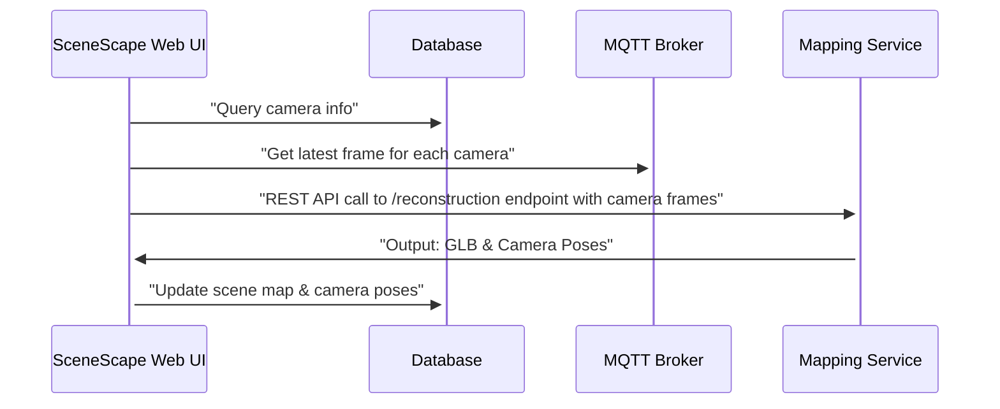

# 3D Mapping Models REST API Service

This Docker container provides a Flask REST API interface for 3D reconstruction with build-time model selection. Each container is built with one of two state-of-the-art models:

- **MapAnything**: Universal Feed-Forward Metric 3D Reconstruction
- **VGGT**: Visual Geometry Grounded Transformer for sparse view reconstruction

## Features

- 🌐 **Flask** based REST API with JSON responses
- 🏗️ **Build-Time Model Selection**: Single model per container, no dependency conflicts
- 📸 **Multi-image Input**: Process multiple images simultaneously
- 🎯 **GLB Output**: Generate 3D models in GLB format
- 📊 **Camera Data**: Extract camera poses and intrinsics
- 🐳 **Containerized**: Model-specific containers for clean deployment

## SceneScape Integration

The following diagram shows the dataflow between the Intel® SceneScape Web UI, database, MQTT broker, and the Mapping Service.



## API Endpoints

### Health Check

```
GET /health
```

Returns service status and model availability.

### List Models

```
GET /models
```

Returns information about the model in this container and its status.

### 3D Reconstruction

```
POST /reconstruction
```

Perform 3D reconstruction from input images.

#### Request Format

```json
{
  "images": [
    {
      "data": "base64_encoded_image_data",
      "filename": "optional_filename.jpg"
    }
  ],
  "output_format": "glb", // "glb" or "json"
  "mesh_type": "mesh" // "mesh" or "pointcloud"
}
```

**Note:** `model_type` is no longer needed - the model is determined at build time.

#### Response Format

```json
{
  "success": true,
  "model": "mapanything", // indicates which model was used
  "glb_data": "base64_encoded_glb_file",
  "camera_poses": [
    {
      "rotation": [0, 0, 0, 0], // quaternion rotation [x, y, z, w]
      "translation": [0, 0, 0] // 3D translation vector [x, y, z]
    }
  ],
  "intrinsics": [
    [
      [0, 0, 0],
      [0, 0, 0],
      [0, 0, 1]
    ] // 3x3 intrinsics matrix [[fx, 0, cx], [0, fy, cy], [0, 0, 1]]
  ],
  "processing_time": 15.23,
  "message": "Success message"
}
```

## Building and Running

Instructions for building the service from source and running it are here: [How to build source](How-to-build-source.md)

## Using the API

### Example with Python Client

```python
import base64
import requests

# Encode images to base64
def encode_image(image_path):
    with open(image_path, "rb") as f:
        return base64.b64encode(f.read()).decode('utf-8')

# Prepare request
payload = {
    "images": [
        {"data": encode_image("image1.jpg"), "filename": "image1.jpg"},
        {"data": encode_image("image2.jpg"), "filename": "image2.jpg"}
    ],
    "output_format": "glb"
}

# Send request
response = requests.post("https://localhost:8444/reconstruction", json=payload)
result = response.json()

if result["success"]:
    # Save GLB file
    glb_data = base64.b64decode(result["glb_data"])
    with open("output.glb", "wb") as f:
        f.write(glb_data)

    print(f"Model used: {result['model']}")
    print(f"Processing time: {result['processing_time']:.2f}s")
    print(f"Camera poses: {len(result['camera_poses'])}")
```

### Using the Included Client

```bash
# Check API health (model-agnostic)
python client_example.py --health-check --insecure

# Specify output type
python client_example.py --images image1.jpg image2.jpg --mesh-type mesh --output mesh.glb --insecure
python client_example.py --images image1.jpg image2.jpg --mesh-type pointcloud --output points.glb --insecure
```

### Using curl

```bash
# Health check
curl https://localhost:8444/health --insecure

# List models
curl https://localhost:8444/models --insecure

# Reconstruction (with base64 encoded images)
curl -X POST "https://localhost:8444/reconstruction" \
  -H "Content-Type: application/json" \
  -d '{
    "images": [{"data": "'$(base64 -w 0 image1.jpg)'", "filename": "image1.jpg"}],
    "output_format": "glb",
    "mesh_type": "mesh"
  }' --insecure
```

## Model Comparison

| Feature               | MapAnything           | VGGT                                                                     |
| --------------------- | --------------------- | ------------------------------------------------------------------------ |
| **License**           | Apache 2.0            | [VGGT License](https://github.com/3d-scene-recon/vggt/blob/main/LICENSE) |
| **Input**             | Multiple images       | Multiple images/video frames                                             |
| **Strength**          | Metric reconstruction | Sparse view reconstruction                                               |
| **Speed**             | Fast                  | Moderate                                                                 |
| **Memory**            | Lower                 | Higher                                                                   |
| **Quality**           | High for dense views  | High for sparse views                                                    |
| **Native Output**     | Watertight mesh       | Point cloud                                                              |
| **Supported Outputs** | Mesh, Point cloud     | Point cloud, Mesh                                                        |

## Development

### Adding Custom Models

To add support for additional models:

1. Create a new model class following the `ReconstructionModel` interface
2. Create a model-specific service file (e.g., `mymodel_service.py`)
3. Add model installation steps to the Dockerfile
4. Update the Makefile to support the new model type
5. Add build-time model selection logic

## Minimum Hardware Requirements

- **CPU**: 12th Gen or newer Intel® Core™ processors (i5 or higher), or 2nd Gen or newer Intel® Xeon® processors
- **RAM**:
  - MapAnything: 8GB minimum (4GB for model + overhead)
  - VGGT: 16GB minimum (8GB for model + overhead, more for high resolution images)
- **Storage**: 12GB free space for Docker images and models

## Performance Notes

- **First Run**: Initial model download may take several minutes
- **Memory Requirements**:
  - MapAnything: ~4GB RAM
  - VGGT: ~8GB RAM (more for high resolution)
- **Processing Time**: Varies by image count and resolution

## Best Practices

- **VGGT** pointcloud output scale is orders of magnitude smaller than the actual scene. Scale of output mesh generated by **Map Anything** is closer than **VGGT** to the actual scene.
- Output mesh generated by **VGGT** version of the service has several issues currently. All of these issues will be addressed in the next Intel® SceneScape release:
  - It is not aligned with the original point cloud
  - The resolution of the texture is not sharp.
  - Pointcloud to mesh conversion takes many multiples of time taken by inference that generates the pointcloud.
- The service has not been tested with cameras having distortion. Expect the reconstruction to perform poorly if your cameras show visual distortion.
- The reconstruction does not distinguish between static and dynamic objects. If the camera frames contain objects like persons, vehicles etc., the reconstruction will include those objects as well. For best results, call the service when the camera frames do not contain objects that should not be included in the mesh.

## Supporting Resources

- [API Reference](api-docs/mapping-api.yaml): Comprehensive reference for the Mapping service REST API endpoints.
